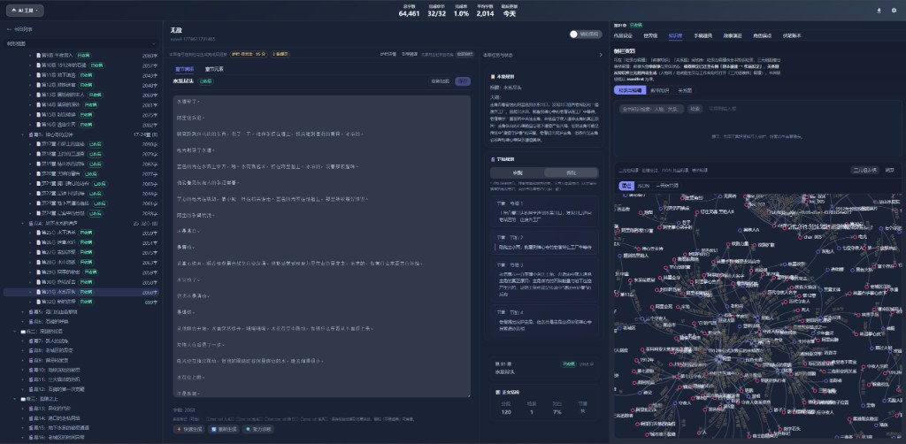

# Alex — 开源剧情引擎内核

> 面向长篇 AI 创作的基础设施：持久记忆 · 知识图谱 · 自动推进流水线 · 质量治理闭环

<p align="center">
  
</p>

<p align="center">
  <a href="https://www.python.org/"></a>
  <a href="https://vuejs.org/"></a>
  <a href="https://fastapi.tiangolo.com/"></a>
  <a href="https://github.com/Alex663028/Alex-Novel-Platform/releases"></a>
  <a href="LICENSE"></a>
</p>

---

## 这是什么

Alex 是一个**剧情引擎内核（Narrative Engine Kernel）**，不是聊天式写作助手，也不是一组提示词模板。

大多数 AI 写作工具解决的是"生成一段文字"的问题。Alex 解决的是一个更难的工程问题：

> **如何让 AI 系统在数十万字的叙事跨度里，维持人物一致性、因果链完整性、伏笔闭合率，并在无人值守的条件下持续推进？**

这不是提示词优化问题，而是**系统工程问题**。Alex 的答案是：构建一套完整的剧情状态管理基础设施，让 LLM 只做它最擅长的事——在结构化上下文中生成高质量叙事片段。

---

## 核心能力

### 1. 叙事状态机
- **Story Bible**：人物档案（含 POV 防火墙、登场频率调度）、地点图、世界设定三元组
- **章级摘要链**：每章生成后自动提炼的压缩摘要，构成跨章上下文骨架
- **伏笔注册表**：钩子（Hook）的开启、悬置、消费状态完整追踪
- **故事线 DAG**：多故事线的有向无环图，可视化分支与汇合点

### 2. 向量语义检索
- **章内容索引**：基于 ChromaDB / FAISS 的本地向量库
- **三元组索引**：从正文中自动抽取的 `(主体, 关系, 客体)` 三元组
- 支持 OpenAI 兼容 API（轻量）和本地 `sentence-transformers` 模型（离线）

### 3. 自动推进引擎
- **十步章节生成管线**：规划 → 上下文装配 → LLM 调用 → 质量验证 → 章末处理
- **熔断保护**：连续失败自动暂停
- **SSE 实时推流**：生成进度实时推送到前端
- **检查点快照**：支持从任意检查点恢复

### 4. 质量治理闭环
- **张力心电图**：每章张力评分（0–10），历史曲线持久化
- **文风漂移检测**：基于向量余弦相似度计算偏离程度
- **陈词滥调扫描**：规则库 + 语义相似度双重检测

---

## 技术栈

| 层 | 技术 |
|----|------|
| 后端框架 | FastAPI + uvicorn |
| 架构范式 | DDD 四层分层 + 独立 engine/ 运行内核 |
| AI 接入 | OpenAI 兼容 / Anthropic Claude / 火山方舟 |
| 向量存储 | ChromaDB / FAISS |
| 主数据库 | SQLite + Write Dispatch 单写者路由 |
| 前端 | Vue 3 + TypeScript + Vite + Naive UI + ECharts |
| 桌面客户端 | Tauri 2.x |

---

## 快速开始

### 方式一：源码启动

```bash
# 后端
python -m venv .venv && source .venv/bin/activate  # Windows: .venv\Scripts\activate
pip install -r requirements.txt
cp .env.example .env    # 填写 LLM 凭证
uvicorn interfaces.main:app --host 127.0.0.1 --port 8005 --reload

# 前端（另开终端）
cd frontend && npm install && npm run dev
```

| 地址 | 说明 |
|------|------|
| `http://127.0.0.1:8005` | 后端 API |
| `http://127.0.0.1:8005/docs` | OpenAPI 交互文档 |
| `http://localhost:3000` | 前端开发服务器 |

### 方式二：桌面安装版

前往 [GitHub Releases](https://github.com/Alex663028/Alex-Novel-Platform/releases) 下载最新安装包。

---

## 架构目录

```
（项目根目录）/
├── domain/                 # 领域层 — 纯业务模型和值对象
├── application/           # 应用层 — 用例编排
├── engine/                # 剧情引擎内核 — 生产运行时
├── infrastructure/        # 基础设施层 — 技术实现
├── interfaces/            # 接口层 — FastAPI、REST API
├── frontend/              # 官方工作台 — Vue 3 + Tauri
├── tests/                 # 单元、集成、E2E 测试
└── scripts/               # 启动、安装、迁移脚本
```

---

## 测试

```bash
pytest tests/ -v
pytest tests/ --cov=. --cov-report=term-missing
```

---

## 更新日志

### v1.1.0 (2026-07-23)

**架构优化**
- 数据库路径统一：`com.plotpilot.desktop` → `com.alex.desktop`（含自动迁移）
- 角色模型合并：4处散落统一到 `domain/character/entities/character.py`
- 路由命名统一：`slug` → `novel_id`（stats 路由）
- stats 路由前缀修正：`/api/stats` → `/api/v1/stats`

**Bug 修复**
- 修复 `BookStats` 字段不匹配（`slug` → `novel_id`）
- 修复前端 API 路径（`exportChapter`、`chapterStream`）
- 修复 `StateBootstrap._load_knowledge` 缺失导致工作台上下文加载异常

**UI 改进**
- 字体对比度修复：WCAG AA 标准（≥4.5:1）

---

## 许可证

本项目采用 **Apache License 2.0**，并附加 **Commons Clause** 条件限制。

- **允许**：学习、修改、非商业内部部署、基于内核的生态扩展（非营利）
- **禁止**：将本项目（含修改版）封装为收费 SaaS、打包售卖源码

详见 [LICENSE](LICENSE)。
